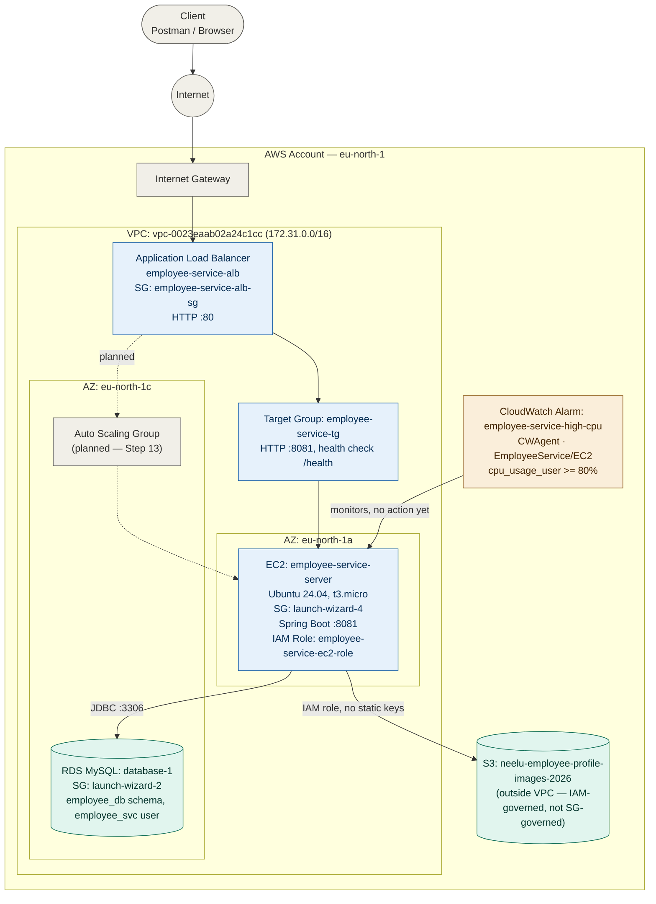
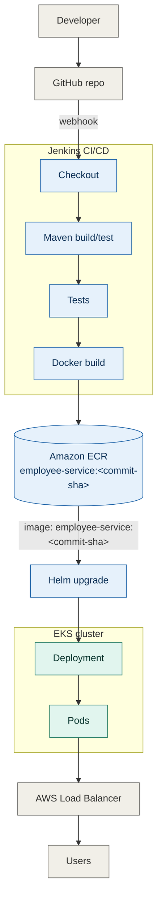

# Employee Management System — AWS Deployment Guide

A step-by-step record of deploying `employee-service` (Spring Boot + MySQL + JWT) to AWS: IAM, EC2, RDS, and an Application Load Balancer, with the remaining steps still to come.

This follows the phases in the [root README](README.md) and maps directly onto the 14-step checklist in [docs/aws-steps.md](docs/aws-steps.md). See also [docs/architecture.md](docs/architecture.md) for the standalone architecture writeup.

---

## Architecture



**Security groups involved:**

| Security Group | Attached To | Key Inbound Rules |
|---|---|---|
| `employee-service-alb-sg` | ALB | HTTP 80 from `0.0.0.0/0` |
| `launch-wizard-4` | EC2 instance | SSH 22 from My IP, TCP 8081 from `employee-service-alb-sg` |
| `launch-wizard-2` | RDS instance | MySQL 3306 from `launch-wizard-4` (and one other project's EC2 SG) |

---

## Application: Employee CRUD + JWT Auth

Before touching AWS, the app itself was built at [`employee-service`](employee-service):

- **Entities**: `Employee`, `User`, `Role` (enum)
- **Layers**: Controller → Service (interface) → ServiceImpl → Repository, with request/response DTOs
- **Security**: `JwtUtil`, `JwtFilter`, `SecurityConfig` — stateless JWT auth, BCrypt password hashing
- **Endpoints**: `/api/auth/register`, `/api/auth/login`, `/api/employees/**` (CRUD, JWT-protected), `/api/users/me`, `/api/users` (ADMIN only), `/health` (public, for the ALB)

Tested locally end-to-end with Postman — creating an employee via `POST /api/employees` and reading it back via `GET /api/employees` both returning `200 OK` with the expected JSON:

```
POST http://localhost:8089/api/employees
Content-Type: application/json

{
  "name": "John Doe",
  "email": "john.doe@example.com",
  "department": "Engineering",
  "designation": "Backend Developer"
}
```

```
GET http://localhost:8089/api/employees
→ 200 OK

[
  {
    "id": 1,
    "name": "John Doe",
    "email": "john.doe@example.com",
    "department": "Engineering",
    "designation": "Backend Developer"
  }
]
```

---

## The 14 AWS Steps

### ✅ Step 1 — Create IAM User

1. Sign in to the [AWS Console](https://console.aws.amazon.com/) as your root or admin account.
2. Go to **IAM** → **Users** (left sidebar) → **Create user**.
3. **User name**: `employee-service-deployer` — this represents the app/deployment, not a personal login.
4. Leave **"Provide user access to the AWS Management Console"** unchecked — this user only needs programmatic access, not console login.
5. On the **Permissions** step, choose **Attach policies directly** and attach:
   - `AmazonS3FullAccess`
   - `AmazonEC2FullAccess`
   
   (`FullAccess` is acceptable for a learning project; a production setup would scope these down to least-privilege.)
6. Skip tags → **Create user**.
7. Open the new user → **Security credentials** tab → **Access keys** → **Create access key**.
   - Use case: **Command Line Interface (CLI)**
   - Confirm the checkbox → **Create access key**
8. Copy the **Access Key ID** and **Secret Access Key** immediately — AWS only shows the secret once. Store them in `~/.aws/credentials` (never commit these to a repo):

```ini
[default]
aws_access_key_id = YOUR_ACCESS_KEY_ID
aws_secret_access_key = YOUR_SECRET_ACCESS_KEY
```


### ✅ Step 2 — Create Key Pair

1. **EC2** → left sidebar under **Network & Security** → **Key Pairs** → **Create key pair**.
2. **Name**: `springboot-key`.
3. **Key pair type**: `RSA`.
4. **Private key file format**: `.pem` (for OpenSSH on macOS/Linux — use `.ppk` only for PuTTY on Windows).
5. **Create key pair** — the `.pem` file downloads automatically. This is the only time AWS gives you the private key; there's no way to re-download it.
6. Lock down the file permissions, or SSH will refuse to use it:

```bash
chmod 400 ~/Downloads/springboot-key.pem
mkdir -p ~/.ssh/aws-keys && mv ~/Downloads/springboot-key.pem ~/.ssh/aws-keys/
```

A key pair isn't tied to one instance or one project — this same `springboot-key.pem` was reused when launching the second EC2 instance for this project, rather than creating a new one. (Key pairs are region-scoped, though: one created in `eu-north-1` won't appear when launching an instance in a different region.)

### ✅ Step 3 — Launch EC2

1. **EC2** → **Instances** → **Launch instances**.
2. **Name**: `employee-service-server`.
3. **AMI**: **Ubuntu 24.04 LTS** (Canonical).
4. **Instance type**: `t3.micro` (free-tier eligible).
5. **Key pair**: select `springboot-key` from the dropdown.
6. **Network settings** → **Edit** → configure the security group:
   - **SSH (22)**: source `My IP`.
   - **Custom TCP (8081)**: source `My IP` (temporary, for testing before the ALB existed).
7. **Configure storage**: default 8GB gp3.
8. **Launch instance**.
9. Wait for **Instance state** = `Running` and **Status check** = `2/2 checks passed`.
10. Note the **Public IPv4 address** from the instance details page.
11. SSH in:


```bash
ssh -i ~/.ssh/aws-keys/springboot-key.pem ubuntu@<PUBLIC_IP>
```

Launched as a *second*, dedicated instance rather than reusing an EC2 already running an unrelated project — keeps the two isolated (no port collisions, a crash in one doesn't affect the other).

```
$ ssh -i springboot-key.pem ubuntu@56.228.11.215
Welcome to Ubuntu 24.04.4 LTS (GNU/Linux 6.17.0-1017-aws x86_64)
...
ubuntu@ip-172-31-22-24:~$
```


### ✅ Step 4 — Install Java

On the EC2 instance, over SSH:

```bash
sudo apt update && sudo apt upgrade -y
sudo apt install -y openjdk-21-jdk
java -version
```

Maven was also needed to build the JAR on the instance (not in the original checklist, but required for Step 6):

```bash
sudo apt install -y maven
mvn -version
```

```
openjdk version "21.0.11" 2026-04-21
OpenJDK Runtime Environment (build 21.0.11+10-1-24.04.2-Ubuntu)
OpenJDK 64-Bit Server VM (build 21.0.11+10-1-24.04.2-Ubuntu, mixed mode, sharing)

Apache Maven 3.8.7
Maven home: /usr/share/maven
Java version: 21.0.11, vendor: Ubuntu, runtime: /usr/lib/jvm/java-21-openjdk-amd64
OS name: "linux", version: "6.17.0-1017-aws", arch: "amd64", family: "unix"
```

### ✅ Step 5 — Create RDS (instead of local MySQL)

Chose RDS over installing MySQL locally on the instance, since RDS is the actual AWS skill this checklist is building toward.

**Create the instance:**

1. **RDS** → **Databases** → **Create database**.
2. **Creation method**: `Standard create`.
3. **Engine type**: `MySQL`.
4. **Templates**: `Free tier`.
5. **Settings**: DB instance identifier `database-1`, master username `admin`, set a real master password.
6. **Instance configuration**: `db.t4g.micro` (free-tier).
7. **Storage**: default 20GB gp2.
8. **Connectivity**:
   - **VPC**: same VPC as the EC2 instance (`vpc-0023eaab02a24c1cc`) — required, since security-group-to-security-group references don't work across different VPCs without peering.
   - **Public access**: `No` — reachable only from resources inside the VPC via security group, never the open internet.
   - **VPC security group**: create new, `launch-wizard-2` (auto-named).
9. **Create database** — takes a few minutes to reach `Available`.


**Networking:**

1. Open the RDS security group (`launch-wizard-2`) → **Inbound rules** → **Edit inbound rules** → **Add rule**.
2. Type: `MYSQL/Aurora` (auto-fills port 3306).
3. Source: select **the EC2 instance's security group** (`launch-wizard-4`) from the dropdown — not a raw IP. This means "only things using that security group can reach me."
4. **Save rules**.


**Isolated schema + user:** this RDS instance also hosts an unrelated project's database, so rather than reusing the master (`admin`) credentials, created a dedicated schema and user scoped only to this project.

On the EC2 instance:

```bash
sudo apt install -y mysql-client
curl -o global-bundle.pem https://truststore.pki.rds.amazonaws.com/global/global-bundle.pem
mysql -h <rds-endpoint> -P 3306 -u admin -p --ssl-mode=VERIFY_IDENTITY --ssl-ca=./global-bundle.pem
```

At the `mysql>` prompt:

```sql
CREATE DATABASE employee_db;
CREATE USER 'employee_svc'@'%' IDENTIFIED BY '********';
GRANT ALL PRIVILEGES ON employee_db.* TO 'employee_svc'@'%';
FLUSH PRIVILEGES;
```

### ✅ Step 6 — Deploy Spring Boot JAR

1. Pushed the project to GitHub: [github.com/temptation4/employee-management-aws-guide](https://github.com/temptation4/employee-management-aws-guide) (public repo — real credentials kept out of the committed `application.properties` via environment-variable placeholders, e.g. `${DB_URL:jdbc:mysql://localhost:3306/employee_db}`).
2. On the EC2 instance:

```bash
git clone https://github.com/temptation4/employee-management-aws-guide.git
cd employee-management-aws-guide/employee-service

export DB_URL="jdbc:mysql://<rds-endpoint>:3306/employee_db"
export DB_USERNAME="employee_svc"
export DB_PASSWORD="********"
export JWT_SECRET="********"

mvn clean package -DskipTests
nohup java -jar target/employee-service-1.0.0.jar > employee-service.log 2>&1 &
```

> The project was later flattened — `02-springboot-project/employee-service` became `employee-service` at the repo root, `01-architecture/` and `03-aws-steps/` became `docs/`. If you already have an older clone on EC2 from before this reorg, run `git pull` and `cd` into the new `employee-service` path.

(Adding those `export` lines to `~/.bashrc` keeps them set across future SSH sessions, rather than re-exporting every time.)

```
:: Spring Boot ::                (v3.3.0)

... Starting EmployeeServiceApplication v1.0.0 using Java 21.0.11
... Tomcat initialized with port 8081 (http)
... HikariPool-1 - Starting...
... HikariPool-1 - Added connection com.mysql.cj.jdbc.ConnectionImpl@71139e77
... HikariPool-1 - Start completed.
Hibernate: create table employees (...)
Hibernate: create table users (...)
... Will secure any request with [..., JwtFilter, ...]
... Tomcat started on port 8081 (http) with context path '/'
... Started EmployeeServiceApplication in 9.683 seconds
```


### ✅ Step 7 — Configure Security Group

`launch-wizard-4` (EC2 instance SG) ended up with:

| Type | Port | Source | Purpose |
|---|---|---|---|
| SSH | 22 | My IP | Remote shell access to manage the server |
| Custom TCP | 8081 | My IP | Direct testing before the ALB existed |
| Custom TCP | 8081 | `employee-service-alb-sg` | Lets the ALB's health checks and forwarded traffic through (added in Step 12) |

To add a rule: open the SG → **Edit inbound rules** → **Add rule** (don't remove existing ones) → set Type/Port/Source → **Save rules**.


### ✅ Step 8 — Test Application

Directly against the instance (before the ALB was in place):

```bash
curl http://<EC2_PUBLIC_IP>:8081/health
# → OK
```

Also exercised the full CRUD + auth flow via Postman: register → login (JWT returned) → create/read/update/delete an employee, all against the live EC2-hosted app.

### ✅ Step 9 — Create S3 Bucket

1. **S3** → **Create bucket**.
2. Bucket name: `neelu-employee-profile-images-2026` (globally unique).
3. Region: `eu-north-1`, same as the rest of the infrastructure.
4. Block Public Access: left **all four boxes checked** (block all public access) — access goes through the app using pre-signed URLs, not public bucket policies.
5. **Create bucket**, then created an `employees/` prefix (folder) for object organization.

### ✅ Step 10 — Create IAM Role for EC2

Used an IAM Role rather than static access keys, since roles auto-rotate credentials and never live in a file on disk:

1. **IAM** → **Roles** → **Create role**.
2. Trusted entity type: `AWS service` → Use case: `EC2`.
3. Attached policy: `AmazonS3FullAccess`.
4. Named it `employee-service-ec2-role`.
5. Attached it to the running instance: **EC2** → select `employee-service-server` → **Actions** → **Security** → **Modify IAM role** → select `employee-service-ec2-role`.

Confirmed on the instance's **Security** tab: `IAM role: employee-service-ec2-role`.


### ✅ Step 11 — Upload Files to S3

Wired into the app, mirroring the pattern from [`springboot-s3-demo`](../springboot-s3-demo):

- `S3Config` — `S3Client`/`S3Presigner` beans, region from `aws.region`. No explicit credentials configured — the AWS SDK's default credential chain automatically picks up the IAM role attached to the EC2 instance in Step 10.
- `S3Service` (interface) / `S3ServiceImpl` — `uploadFile`, `generatePreSignedUrl` (10-minute expiry), `deleteFile`, all scoped to the `aws.bucket` property.
- `Employee` entity gained a `profilePictureKey` field; `EmployeeResponse` exposes it as a `hasProfilePicture` boolean rather than the raw S3 key.
- New endpoints on `EmployeeController`:
  - `POST /api/employees/{id}/profile-picture` — multipart upload, stores at `employees/{id}/{filename}`
  - `GET /api/employees/{id}/profile-picture` — returns a pre-signed download URL
  - `DELETE /api/employees/{id}/profile-picture` — removes from S3 and clears the key

```bash
export AWS_REGION="eu-north-1"
export AWS_S3_BUCKET="neelu-employee-profile-images-2026"
```

(Only needed if overriding the defaults already baked into `application.properties` — no AWS access keys required on the instance, since the IAM role handles authentication.)

**Verified end-to-end via Postman:**

1. `POST /api/employees/{id}/profile-picture` (multipart form-data, key `file`):

```
POST http://localhost:8089/api/employees/1/profile-picture
Authorization: Bearer {{token}}
Body: form-data → file (type: File) → [selected image]

→ 200 OK
Profile picture uploaded successfully.
```

2. Confirmed in the S3 console: the object landed in the bucket at `employees/1/<filename>`.


3. `GET /api/employees/{id}/profile-picture` → returned a presigned URL; opening it in a browser tab loaded the image directly from S3.

4. `GET /api/employees/{id}` → `hasProfilePicture` now `true`.

### ✅ Step 12 — Create ALB

Built out of order relative to the checklist (before S3), since it was the next unfinished phase in the README's roadmap.

**Target Group:**

1. **EC2** → **Target Groups** → **Create target group**.
2. Target type: `Instances`.
3. Name: `employee-service-tg`.
4. Protocol/Port: `HTTP` / `8081`.
5. VPC: `vpc-0023eaab02a24c1cc`.
6. Health check path: `/health` — a dedicated public endpoint (`HealthController` + `SecurityConfig` permitAll) added specifically for this, since every other endpoint requires a JWT and would always fail health checks.
7. Register `employee-service-server` as the target on port 8081 → **Create target group**.

> 📸 **Screenshot needed:** `docs/screenshots/08-target-group-healthy.png` — the Target Group detail page showing **1 Healthy** target.

**Load Balancer:**

1. **EC2** → **Load Balancers** → **Create load balancer** → **Application Load Balancer**.
2. Name: `employee-service-alb`. Scheme: `Internet-facing`.
3. VPC: `vpc-0023eaab02a24c1cc`. Select **2 Availability Zones** (`eu-north-1a`, `eu-north-1c`) — ALBs require at least 2 AZs even though the EC2 instance only lives in one.
4. Security group: created a dedicated `employee-service-alb-sg` (HTTP 80 from `0.0.0.0/0` inbound, all traffic outbound) rather than reusing the `default` SG.
5. Listener: `HTTP` : `80` → forward to `employee-service-tg`.
6. **Create load balancer**.

> 📸 **Screenshot needed:** `docs/screenshots/09-alb-active.png` — the Load Balancers list showing `employee-service-alb` with State = **Active**.

**Closing the loop:** added the inbound rule on `launch-wizard-4` (Step 7's table, row 3) allowing 8081 from `employee-service-alb-sg` — without it, the ALB's health checks and forwarded traffic are blocked even with the app running correctly.

**Verification:**

```bash
curl http://<ALB_DNS_NAME>/health
# → OK
```

Traffic now flows: **Client → ALB (port 80) → Target Group → EC2 (port 8081) → Spring Boot → RDS**.

```
$ curl http://employee-service-alb-353208618.eu-north-1.elb.amazonaws.com/health
OK
$ curl http://56.228.11.215:8081/health
OK
```

Both the ALB path and the direct EC2 path respond — confirms the target group is routing correctly.

### ⏳ Step 13 — Create Auto Scaling Group

`employee-service-tg` (created in Step 12) is reused as-is here — the ASG attaches new instances to this same target group rather than needing a new one.

*Not yet done.* Planned approach:

1. Create a **Launch Template** from the current `employee-service-server` configuration (AMI, instance type, key pair, security group, and a user-data script that pulls the latest code and starts the JAR on boot).
2. **EC2** → **Auto Scaling Groups** → **Create Auto Scaling group**, using that launch template.
3. Attach it to the existing `employee-service-tg` target group, so the ALB automatically picks up new instances.
4. Set desired/min/max capacity (e.g. min 1, desired 1, max 3 for a learning project).

### ✅ Step 14 — Configure CloudWatch Alarm

Built ahead of Step 13 — this alarm currently watches the single `employee-service-server` instance directly rather than an ASG, since the ASG doesn't exist yet. It has no scaling action attached (pure observability for now); once Step 13 is done, this same alarm can be pointed at an ASG scaling policy instead.

Also went a level deeper than plain EC2 monitoring: the default `CPUUtilization` metric (namespace `AWS/EC2`) is hypervisor-level and doesn't need anything installed, but it's coarse. Installing the **CloudWatch Agent** gives OS-level metrics (per-process CPU breakdown, actual memory/disk usage) that the hypervisor can't see.

**1. Install the CloudWatch Agent on the instance:**

```bash
wget https://amazoncloudwatch-agent.s3.amazonaws.com/ubuntu/amd64/latest/amazon-cloudwatch-agent.deb
sudo dpkg -i -E ./amazon-cloudwatch-agent.deb
```

**2. IAM permissions:** the agent needs to push metrics to CloudWatch, so `employee-service-ec2-role` (from Step 10) also needs the `CloudWatchAgentServerPolicy` managed policy attached, alongside the existing `AmazonS3FullAccess` — **IAM** → **Roles** → `employee-service-ec2-role` → **Add permissions** → **Attach policies** → `CloudWatchAgentServerPolicy`.

**3. Configure the agent** — `/opt/aws/amazon-cloudwatch-agent/etc/amazon-cloudwatch-agent.d/file_amazon-cloudwatch-agent.json`:

```json
{
  "agent": {
    "metrics_collection_interval": 60,
    "run_as_user": "cwagent"
  },
  "metrics": {
    "namespace": "EmployeeService/EC2",
    "metrics_collected": {
      "cpu": {
        "measurement": ["cpu_usage_idle", "cpu_usage_user", "cpu_usage_system"],
        "metrics_collection_interval": 60,
        "totalcpu": true
      },
      "mem": {
        "measurement": ["mem_used_percent"],
        "metrics_collection_interval": 60
      },
      "disk": {
        "measurement": ["used_percent"],
        "metrics_collection_interval": 60,
        "resources": ["/"]
      }
    }
  }
}
```

**4. Start the agent with that config:**

```bash
sudo /opt/aws/amazon-cloudwatch-agent/bin/amazon-cloudwatch-agent-ctl \
  -a fetch-config -m ec2 -s \
  -c file:/opt/aws/amazon-cloudwatch-agent/etc/amazon-cloudwatch-agent.d/file_amazon-cloudwatch-agent.json
```

**5. Create the alarm:**

1. **CloudWatch** → **Alarms** → **Create alarm**.
2. Select metric → namespace `EmployeeService/EC2` → `cpu_usage_user`.
3. Condition: `cpu_usage_user >= 80` for 1 datapoint within 5 minutes.
4. Name: `employee-service-high-cpu`.
5. No action configured yet — currently alerts to `OK`/`In alarm` status only, visible on the CloudWatch Alarms dashboard.

> 📸 **Screenshot needed:** `docs/screenshots/14-cloudwatch-alarm.png` — the `employee-service-high-cpu` alarm detail page showing the `cpu_usage_user` graph and `OK` status.

---

## Target Architecture — CI/CD to EKS (planned, in progress)

Everything above is a manually-managed single EC2 instance. The longer-term target replaces that with a proper CI/CD pipeline deploying containers to Kubernetes:

**Full target stack:**

| Layer | Technology |
|---|---|
| Source | GitHub |
| CI/CD | Jenkins |
| Build | Maven |
| Java | Java 21 |
| Container | Docker |
| Registry | Amazon ECR |
| Runtime | Amazon EKS |
| Packaging | Helm |
| Load Balancer | AWS ALB |
| Infrastructure | Terraform |
| Monitoring | CloudWatch + Prometheus/Grafana |
| Secrets | AWS Secrets Manager |
| IAM | IAM Roles / EKS Pod Identity |
| Logging | CloudWatch Logs |

**Target repo layout** (`employee-service/`):

```
employee-service/
├── src/
├── pom.xml
├── Dockerfile
├── Jenkinsfile
├── helm/
│   └── employee-service/
│       ├── Chart.yaml
│       ├── values.yaml
│       └── templates/
│           ├── deployment.yaml
│           ├── service.yaml
│           ├── ingress.yaml
│           ├── configmap.yaml
│           └── hpa.yaml
└── terraform/
    ├── main.tf
    ├── variables.tf
    ├── outputs.tf
    ├── vpc.tf
    ├── eks.tf
    └── ecr.tf
```

Separation of concerns: Terraform provisions infrastructure (VPC, EKS, ECR), Helm deploys the application onto that infrastructure, Jenkins orchestrates the pipeline connecting the two.



**Why this replaces the current setup:**

| Today (EC2) | Target (EKS) |
|---|---|
| `git pull` + `mvn package` + `nohup java -jar` by hand on the instance | Jenkins builds, tests, and containerizes on every push — no manual SSH deploy step |
| JAR file distributed via git | Immutable, versioned Docker images in ECR, tagged by commit SHA |
| Single EC2 instance, manually restarted on failure | Kubernetes restarts crashed pods automatically; rolling updates via `helm upgrade` with zero downtime |
| Planned ASG (Step 13) scales EC2 instances | Kubernetes Horizontal Pod Autoscaler scales pods — makes Step 13 as originally scoped unnecessary |
| ALB points at a target group of EC2 instances | AWS Load Balancer Controller provisions/manages the ALB directly from Kubernetes Ingress/Service objects |

**Rough build order, when this gets picked up:**
1. ✅ Add a `Dockerfile` to `employee-service`, verify it runs locally
2. ✅ Create an ECR repository, push an image manually first (prove the container works before automating anything)
3. ⏳ Stand up Jenkins (either on a small EC2 instance, or AWS-managed alternatives worth comparing: CodePipeline/CodeBuild, or GitHub Actions instead of Jenkins entirely — simpler to operate, no server to maintain)
4. Write the Jenkinsfile: checkout → `mvn test` → `docker build` → push to ECR
5. Stand up an EKS cluster (`eksctl` is the fastest path), write Kubernetes Deployment/Service manifests, wrap them in a Helm chart
6. Install the AWS Load Balancer Controller in the cluster, wire the Helm chart's Service to provision an ALB via Ingress
7. Point Jenkins's last pipeline stage at `helm upgrade`

Steps 3-7 not started — RDS and S3 stay as-is either way (EKS pods would connect to the same RDS instance and use the same S3 bucket via a Kubernetes-native IAM mechanism, IRSA, instead of an EC2 instance role).

**Step 1, verified:**

```dockerfile
FROM eclipse-temurin:21-jre
WORKDIR /app
COPY target/employee-service-1.0.0.jar app.jar
EXPOSE 8081
ENTRYPOINT ["java", "-jar", "app.jar"]
```

```bash
mvn clean package -DskipTests
docker build -t employee-service:local .
docker run -d --name employee-service-test -p 8091:8081 \
  -e DB_URL="jdbc:mysql://host.docker.internal:3306/employee_db" \
  -e DB_USERNAME="root" \
  -e DB_PASSWORD="password" \
  employee-service:local

curl http://localhost:8091/health
# → OK
```

`host.docker.internal` is Docker Desktop's special DNS name for reaching the host machine from inside a container — `localhost` inside the container refers to the container itself, not your Mac, so a local MySQL install needs this to be reachable.

In the process, found and fixed a drift: `application.properties` had `server.port=8089` left over from earlier local Postman testing, while the Dockerfile (and every production reference — EC2, the ALB target group) uses `8081`. Reverted to `8081` to match everywhere.

**Step 2, verified:**

```bash
aws ecr create-repository --repository-name employee-service --region eu-north-1

aws ecr get-login-password --region eu-north-1 | \
  docker login --username AWS --password-stdin 620969610221.dkr.ecr.eu-north-1.amazonaws.com

docker tag employee-service:local 620969610221.dkr.ecr.eu-north-1.amazonaws.com/employee-service:latest
docker push 620969610221.dkr.ecr.eu-north-1.amazonaws.com/employee-service:latest
```

Pushed successfully — `620969610221.dkr.ecr.eu-north-1.amazonaws.com/employee-service:latest`, ~186MB. `aws ecr describe-images` confirms it as `ACTIVE`. The manifest is a multi-arch image index (separate `linux/amd64`/`linux/arm64` digests under one `latest` tag) — a side effect of building with Docker Desktop's default `buildx` on Apple Silicon; EKS worker nodes will pull whichever architecture they run on automatically.

> Cost note: ECR only bills for what's stored — no fixed hourly charge like EKS. Delete the repository (or just the images in it) once you're done experimenting and billing stops immediately; a single ~186MB image is within the AWS free tier's 500MB-month private-repo allowance for new accounts anyway.

---

## What's Next

In order:

1. **Step 13** — Auto Scaling Group (then wire `employee-service-high-cpu` to its scaling policy) — worth reconsidering given the EKS target above makes EC2-level ASG a stepping stone rather than the end state
2. Remaining README phases not yet started: **Phase 7 (SQS)**, **Phase 8 (Redis)**
3. Target architecture (CI/CD → EKS) — longer-term, see above

---

## Screenshot Checklist

Six remaining — save into `docs/screenshots/` (or attach directly on GitHub the same way as the others) with the filename below, then let me know and I'll wire them in:

| Filename | What it should show |
|---|---|
| `08-target-group-healthy.png` | Target Group page showing 1 Healthy |
| `09-alb-active.png` | Load Balancers list, `employee-service-alb` = Active |
| `11-s3-upload-success.png` | Postman: profile-picture upload request/response (`200 OK`) |
| `12-s3-bucket-object.png` | S3 console: uploaded object inside `employees/{id}/` |
| `13-s3-presigned-url-image.png` | Browser tab showing the image loaded from the presigned URL |
| `14-cloudwatch-alarm.png` | `employee-service-high-cpu` alarm graph and `OK` status |
