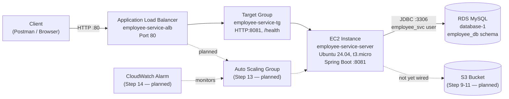

# Employee Management System — AWS Deployment Guide

A step-by-step record of deploying `employee-service` (Spring Boot + MySQL + JWT) to AWS: IAM, EC2, RDS, and an Application Load Balancer, with the remaining steps still to come.

This follows the phases in the [root README](README.md) and maps directly onto the 14-step checklist in [03-aws-steps/aws-steps.md](03-aws-steps/aws-steps.md).

---

## Architecture



**Security groups involved:**

| Security Group | Attached To | Key Inbound Rules |
|---|---|---|
| `employee-service-alb-sg` | ALB | HTTP 80 from `0.0.0.0/0` |
| `launch-wizard-4` | EC2 instance | SSH 22 from My IP, TCP 8081 from `employee-service-alb-sg` |
| `launch-wizard-2` | RDS instance | MySQL 3306 from `launch-wizard-4` (and one other project's EC2 SG) |

---

## Application: Employee CRUD + JWT Auth

Before touching AWS, the app itself was built at [`02-springboot-project/employee-service`](02-springboot-project/employee-service):

- **Entities**: `Employee`, `User`, `Role` (enum)
- **Layers**: Controller → Service (interface) → ServiceImpl → Repository, with request/response DTOs
- **Security**: `JwtUtil`, `JwtFilter`, `SecurityConfig` — stateless JWT auth, BCrypt password hashing
- **Endpoints**: `/api/auth/register`, `/api/auth/login`, `/api/employees/**` (CRUD, JWT-protected), `/api/users/me`, `/api/users` (ADMIN only), `/health` (public, for the ALB)

Tested locally with the Postman collection at [`02-springboot-project/employee-service/postman/employee-service.postman_collection.json`](02-springboot-project/employee-service/postman/employee-service.postman_collection.json).

> 📸 **Screenshot needed:** `docs/screenshots/00-postman-collection.png` — Postman showing the collection folders (Auth / Employees / Users) with a successful login response.

---

## The 14 AWS Steps

### ✅ Step 1 — Create IAM User

Created an IAM user (`employee-service-deployer`) with `AmazonS3FullAccess` and `AmazonEC2FullAccess` attached directly, and generated an access key for CLI/local use.

> 📸 **Screenshot needed:** `docs/screenshots/01-iam-user.png` — the IAM user's summary page (Permissions tab).

### ✅ Step 2 — Create Key Pair

Created `springboot-key.pem` (RSA, `.pem` format, for OpenSSH on macOS) — reused across both EC2 instances in this account rather than creating one per instance.

```bash
chmod 400 springboot-key.pem
```

### ✅ Step 3 — Launch EC2

- AMI: **Ubuntu 24.04 LTS**
- Instance type: `t3.micro` (free-tier eligible)
- VPC: `vpc-0023eaab02a24c1cc`
- Named `employee-service-server` — launched as a *second*, dedicated instance rather than reusing the EC2 already running an unrelated project, to keep the two isolated.

> 📸 **Screenshot needed:** `docs/screenshots/03-ec2-launch-review.png` — the "Launch instance" review pane showing AMI, instance type, and security group summary.

### ✅ Step 4 — Install Java

```bash
sudo apt update && sudo apt upgrade -y
sudo apt install -y openjdk-21-jdk
java -version
```

Maven was also needed (not in the original checklist, but required to build the JAR on the instance):

```bash
sudo apt install -y maven
mvn -version
```

> 📸 **Screenshot needed:** `docs/screenshots/04-java-maven-version.png` — terminal output of `java -version` and `mvn -version` on the EC2 instance.

### ✅ Step 5 — Create RDS (instead of local MySQL)

Chose RDS over installing MySQL locally on the instance, since RDS is the actual AWS skill this checklist is building toward.

- Engine: **MySQL Community 8.4**, `db.t4g.micro` (Free tier template)
- Public access: **No** — reachable only from resources inside the VPC via security group, not the open internet
- Same VPC as the EC2 instance — required for security-group-to-security-group referencing (can't reference an SG across different VPCs without peering)

> 📸 **Screenshot needed:** `docs/screenshots/05-rds-summary.png` — the RDS instance Summary panel (status, class, engine).

**Networking:** added an inbound rule on the RDS security group (`launch-wizard-2`) allowing MySQL/Aurora (3306) with **source = the EC2 instance's security group** (`launch-wizard-4`), not a raw IP.

> 📸 **Screenshot needed:** `docs/screenshots/06-rds-security-group-rules.png` — the RDS SG's inbound rules table showing the MySQL/Aurora rule sourced from the EC2 SG.

**Isolated schema + user:** this RDS instance also hosts an unrelated project's database, so rather than reusing the master (`admin`) credentials, created a dedicated schema and user scoped only to this project:

```sql
CREATE DATABASE employee_db;
CREATE USER 'employee_svc'@'%' IDENTIFIED BY '********';
GRANT ALL PRIVILEGES ON employee_db.* TO 'employee_svc'@'%';
FLUSH PRIVILEGES;
```

Connected from the EC2 instance using the MySQL client (`sudo apt install -y mysql-client`) and AWS's TLS cert bundle:

```bash
curl -o global-bundle.pem https://truststore.pki.rds.amazonaws.com/global/global-bundle.pem
mysql -h <rds-endpoint> -P 3306 -u admin -p --ssl-mode=VERIFY_IDENTITY --ssl-ca=./global-bundle.pem
```

### ✅ Step 6 — Deploy Spring Boot JAR

1. Pushed the project to GitHub: [github.com/temptation4/employee-management-aws-guide](https://github.com/temptation4/employee-management-aws-guide) (public repo — credentials kept out of the committed `application.properties` via environment-variable placeholders, e.g. `${DB_URL:jdbc:mysql://localhost:3306/employee_db}`).
2. On the EC2 instance:

```bash
git clone https://github.com/temptation4/employee-management-aws-guide.git
cd employee-management-aws-guide/02-springboot-project/employee-service

export DB_URL="jdbc:mysql://<rds-endpoint>:3306/employee_db"
export DB_USERNAME="employee_svc"
export DB_PASSWORD="********"
export JWT_SECRET="********"

mvn clean package -DskipTests
java -jar target/employee-service-1.0.0.jar
```

> 📸 **Screenshot needed:** `docs/screenshots/07-app-startup-logs.png` — terminal showing the Spring Boot banner, `HikariPool-1 - Start completed`, and `Tomcat started on port(s): 8081`.

### ✅ Step 7 — Configure Security Group

`launch-wizard-4` (EC2 instance SG) ended up with:

| Type | Port | Source | Purpose |
|---|---|---|---|
| SSH | 22 | My IP | Remote shell access to manage the server |
| Custom TCP | 8081 | My IP | Direct testing before the ALB existed |
| Custom TCP | 8081 | `employee-service-alb-sg` | Lets the ALB's health checks and forwarded traffic through (added later, in Step 12) |

> 📸 **Screenshot needed:** `docs/screenshots/07b-ec2-security-group-rules.png` — the EC2 SG's inbound rules table showing all three rules above.

### ✅ Step 8 — Test Application

Verified directly against the instance (before the ALB was in place):

```bash
curl http://<EC2_PUBLIC_IP>:8081/health
# → OK
```

Also exercised the full CRUD + auth flow via the Postman collection (register → login → create/read/update/delete employee).

### ⏳ Step 9 — Create S3 Bucket

A bucket already exists for this project but isn't wired into the application yet — planned for profile-picture upload, following the same pattern as [`springboot-s3-demo`](../springboot-s3-demo).

### ⏳ Step 10 — Create IAM Role for EC2

Not yet done. Currently the app has no AWS SDK credentials configured on the instance; once S3 upload is added, an IAM role (rather than static access keys) should be attached to the EC2 instance for S3 access.

### ⏳ Step 11 — Upload Files to S3

Depends on Steps 9 and 10 — planned alongside the profile-picture upload feature.

### ✅ Step 12 — Create ALB

Built out of order relative to the checklist (before S3), since it was the next unfinished phase in the README's roadmap.

**Target Group** (`employee-service-tg`):
- Type: Instance, HTTP:8081
- Health check path: `/health` — added a dedicated public endpoint (`HealthController` + `SecurityConfig` permitAll) specifically for this, since every other endpoint requires a JWT and would always fail health checks
- Registered target: `employee-service-server`

> 📸 **Screenshot needed:** `docs/screenshots/08-target-group-healthy.png` — the Target Group detail page showing **1 Healthy** target.

**Load Balancer** (`employee-service-alb`):
- Internet-facing, 2 Availability Zones (`eu-north-1a`, `eu-north-1c`) — ALBs require at least 2 AZs even though the EC2 instance only lives in one
- Security group: `employee-service-alb-sg` (HTTP 80 from `0.0.0.0/0` inbound, all traffic outbound)
- Listener: HTTP:80 → forwards to `employee-service-tg`

> 📸 **Screenshot needed:** `docs/screenshots/09-alb-active.png` — the Load Balancers list showing `employee-service-alb` with State = **Active**.

**Verification:**

```bash
curl http://<ALB_DNS_NAME>/health
# → OK
```

Traffic now flows: **Client → ALB (port 80) → Target Group → EC2 (port 8081) → Spring Boot → RDS**.

> 📸 **Screenshot needed:** `docs/screenshots/10-curl-via-alb.png` — terminal showing the `curl` call against the ALB DNS name returning `OK`.

### ⏳ Step 13 — Create Auto Scaling Group

Not yet done. Would replace the single manually-managed EC2 instance with a Launch Template + ASG behind the existing ALB/target group, so instances scale and self-heal automatically.

### ⏳ Step 14 — Configure CloudWatch Alarm

Not yet done. Planned once the ASG exists — an alarm on CPU utilization (or request count) driving scale-out/scale-in policies.

---

## What's Next

In order:

1. **Step 9-11** — S3 bucket wiring: IAM role for EC2, profile-picture upload/download endpoints
2. **Step 13** — Auto Scaling Group
3. **Step 14** — CloudWatch alarm
4. Remaining README phases not yet started: **Phase 7 (SQS)**, **Phase 8 (Redis)**

---

## Screenshot Checklist

Save each into `docs/screenshots/` with the exact filename below, then let me know and I'll wire them into this doc:

| Filename | What it should show |
|---|---|
| `00-postman-collection.png` | Postman: collection folders + a successful login response |
| `01-iam-user.png` | IAM user summary/permissions page |
| `03-ec2-launch-review.png` | EC2 "Launch instance" review pane |
| `04-java-maven-version.png` | Terminal: `java -version` + `mvn -version` |
| `05-rds-summary.png` | RDS instance Summary panel |
| `06-rds-security-group-rules.png` | RDS SG inbound rules (MySQL/Aurora sourced from EC2 SG) |
| `07-app-startup-logs.png` | Terminal: Spring Boot startup logs, Tomcat on 8081 |
| `07b-ec2-security-group-rules.png` | EC2 instance SG inbound rules (SSH, 8081 ×2) |
| `08-target-group-healthy.png` | Target Group page showing 1 Healthy |
| `09-alb-active.png` | Load Balancers list, `employee-service-alb` = Active |
| `10-curl-via-alb.png` | Terminal: `curl` through the ALB DNS returning `OK` |
