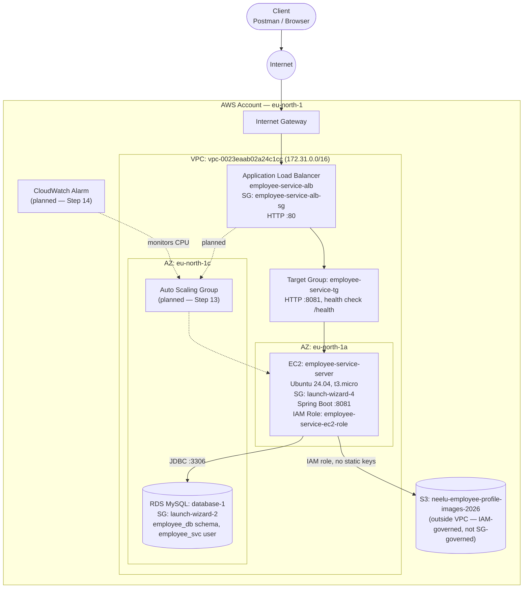

# Architecture

Current state and target state for `employee-service` on AWS. For the step-by-step build log (including screenshots), see [AWS_DEPLOYMENT_GUIDE.md](../AWS_DEPLOYMENT_GUIDE.md#architecture) — this file is the standalone reference diagram.

## Traffic flow

`Client → ALB (:80) → Target Group → EC2 (:8081, Spring Boot) → RDS (:3306) / S3`

The ALB is the only public entry point on the app path — the EC2 instance's security group only accepts port 8081 from the ALB's security group (plus a temporary rule from the developer's own IP, used before the ALB existed). RDS is not publicly accessible at all; it only accepts connections from the EC2 instance's security group.

## Identity and access

- **`employee-service-deployer`** (IAM user) — used from the local machine to launch/configure AWS resources via the console; not used by the running application.
- **`employee_svc`** (RDS user) — scoped only to the `employee_db` schema on `database-1`, which also hosts an unrelated project's database on the same RDS instance. No shared credentials between the two.
- **`employee-service-ec2-role`** (IAM role, attached to the EC2 instance) — grants S3 access via the AWS SDK's default credential chain. No static AWS access keys live on the instance or in the repo.

## Why S3 sits outside the VPC boundary in the diagram

Unlike EC2/RDS/ALB, S3 isn't a VPC-attached resource — access to it is controlled entirely by IAM (the instance role) and, optionally, bucket policies, not security groups. That's why `employee-service-ec2-role` exists: it's the S3 equivalent of what a security group does for network-level resources.

## Planned (not yet built)

- **Auto Scaling Group** (Step 13) — replace the single manually-managed EC2 instance with a Launch Template + ASG behind the existing target group.
- **CloudWatch Alarm** (Step 14) — CPU-utilization-based scaling policy once the ASG exists.
- **SQS Notification Service** (README Phase 7) and **Redis Cache** (README Phase 8) — not started.
